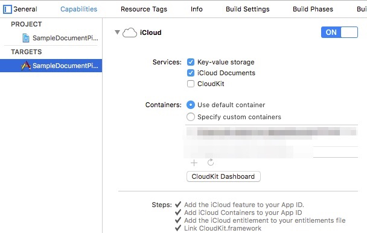

# SampleDocumentPicker

Sample code for DocumentPicker.

## Description

SampleDocumentPicker is the iOS app that can import and export to data files.  
Programming language is written in swift3.0.

## Note
If 	is not working, set iCloud settings.

## Installation
$ git clone https://github.com/amarron1/SampleDocumentPicker.git

## Refarence
- [Document Picker Programming Guide](https://developer.apple.com/library/content/documentation/FileManagement/Conceptual/DocumentPickerProgrammingGuide/AccessingDocuments/AccessingDocuments.html)
- [Uniform Type Identifier Concepts](https://developer.apple.com/library/content/documentation/FileManagement/Conceptual/understanding_utis/understand_utis_conc/understand_utis_conc.html)
